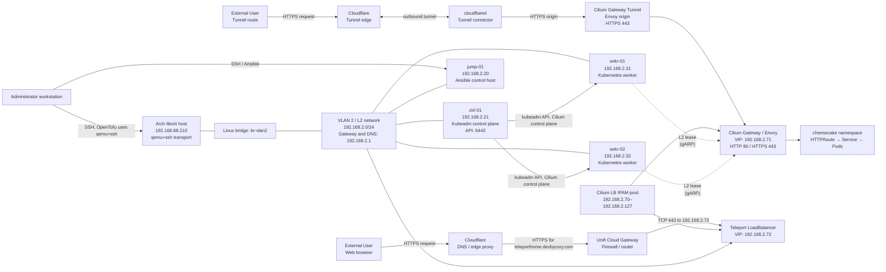

# Libvirt Map

This describes the current libvirt deployment.

## Network facts

Each VM has one virtio NIC on `br-vlan2`. Cloud-init gives it a static
`192.168.2.x/24` address, default route, DNS server, and `lab.local` search
domain. These VMs and the Cilium VIPs sit on the physical VLAN, not libvirt
NAT on `virbr0`.

The L2 announcement policy leaves out the control-plane node. A worker
advertises each LoadBalancer IP, and the other worker can take over the lease.
The DHCP range excludes `192.168.2.70` through `.127`. `.71` is for the HTTPS
Gateway and `.72` is for Teleport.

The tunnel path is optional. `cloudflared` opens an outbound connection to
Cloudflare, which forwards the application request to the Cilium Gateway
origin. It avoids a second inbound WAN port-forward for the application.
