# Proxmox network map

Proxmox lab config. This one had several pitfalls with vlan 70, vlan 2, and my access over wireguard.
This resulted in a couple of days of infrastructure troubleshooting due to a switch losing its config and dropping
traffic destined for vlan70. While ultimately I was able to get everything running, I prefer the simpler libvirt path.

```mermaid
flowchart LR
    User["External user\nWeb browser"]
    Cloudflare["Cloudflare\nDNS and ACME DNS-01"]
    appPublicIP["Application external IP\nDNS record for cheesecake"]
    teleportPublicIP["Teleport external IP\nDNS record for Teleport"]
    Firewall["Site firewall / router\nWAN forwarding configured outside this repo"]
    admin["Administrator workstation"]
    proxmox["Proxmox VE node\ntarget_node: pve\nAPI: pve.example.lan:8006"]
    bridge["Proxmox bridge\nvmbr0\nVLAN tag: 0 by default"]
    clusterNet["VLAN 70 / L2 network\n192.168.70.0/24\nGateway and DNS: 192.168.70.1"]

    control["ctrl-01\n192.168.70.21\nKubeadm API: 6443"]
    worker1["wrkr-01\n192.168.70.31\nKubernetes worker"]
    worker2["wrkr-02\n192.168.70.32\nKubernetes worker"]
    jump["jump-01\n192.168.2.20\nAnsible control host"]
    mgmtBridge["Management bridge\nvmbr1"]

    pool["Cilium LB IPAM pool\n192.168.70.70-192.168.70.127"]
    gateway["Cilium Gateway / Envoy\nVIP: 192.168.70.71\nHTTP 80 / HTTPS 443"]
    teleport["Teleport LoadBalancer\nVIP: 192.168.70.72\nHTTPS multiplex"]
    app["cheesecake namespace\nHTTPRoute -> Service -> Pods"]

    admin -->|"HTTPS API and OpenTofu"| proxmox
    admin -->|"SSH / Ansible"| jump
    User -->|"HTTPS to application or Teleport"| Cloudflare
    Cloudflare -->|"cheesecake DNS record"| appPublicIP
    Cloudflare -->|"Teleport DNS record"| teleportPublicIP
    appPublicIP -->|"HTTPS to Envoy"| Firewall
    teleportPublicIP -->|"HTTPS to Teleport"| Firewall
    Firewall -->|"443 to Gateway VIP"| gateway
    Firewall -->|"443 to Teleport VIP"| teleport

    proxmox --- bridge
    bridge --- clusterNet
    clusterNet --- control
    clusterNet --- worker1
    clusterNet --- worker2
    bridge --> mgmtBridge
    mgmtBridge --> jump
    jump --> control

    control -->|"kubeadm API and Cilium control plane"| worker1
    control -->|"kubeadm API and Cilium control plane"| worker2
    pool --> gateway
    pool --> teleport
    worker1 -.->|"L2 announcement"| gateway
    worker2 -.->|"L2 announcement"| gateway
    gateway --> app
```

## Network facts

`vmbr0` is the primary virtio NIC bridge. By default it is untagged `VLAN 0`
Set `network_bridge` and `vlan_tag` to the bridge and VLAN carried by
the Proxmox host.

The nodes use `192.168.70.20` through `.32`. The Cilium pool spans
`192.168.70.70` through `.127`, with `.71` reserved for the HTTPS Gateway and
`.72` for Teleport. Cilium L2 use gARP to report on its cluster interfaces.

When a `jump-01` node has `mgmt_ip` and `proxy_jump: true`, 
Terraform writes an Ansible inventory that reaches the
cluster nodes through that jump host.

Proxmox uses two external addresses. Cloudflare DNS points the application
hostname at the address forwarded through a Firewalla to the Cilium Gateway VIP, and the Teleport
hostname at the address forwarded through a Firewalla to the Teleport VIP. 
